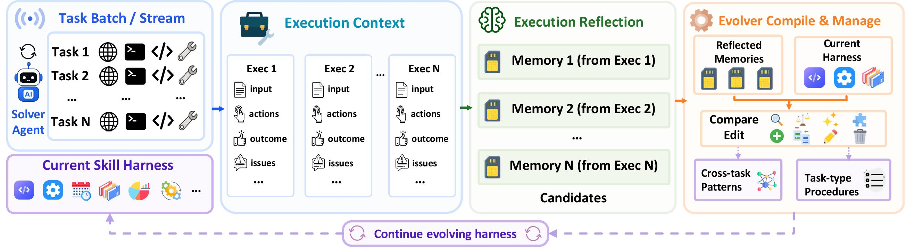

# Evo-Harness: Context-to-Harness Skill Compilation for Self-Evolving Agents

Official implementation of **“EVO-HARNESS: Context-to-Harness Skill Compilation for Self-Evolving Agents.”**

EVO-HARNESS studies the effectiveness of online harness learning: a frozen solver processes a task stream while an external skill harness is updated from execution context and grounded feedback. The release contains the five benchmark pipelines used in the paper and streamlined experiment configurations derived from the latest runs.

<p align="center">
  <a href="figures/main.jpg">
    
  </a>
</p>

## Method

EVO-HARNESS performs **online harness learning**: it improves a frozen solver by compiling execution experience into an external, reusable skill harness. Unlike experience retrieval, which replays similar past cases, EVO-HARNESS converts noisy trajectories and evaluator feedback into structured guidance for planning, acting, verification, and recovery.

### Context-to-Harness Compilation

For each task batch, EVO-HARNESS follows a continual update loop:

`Select → Inject → Execute → Reflect → Compile → Update`

- **Select and inject.** A compact, task-relevant subset of the current harness is selected under a context budget and added to the solver's task context.
- **Execute and evaluate.** The frozen solver completes the task, producing an action trajectory, observations, an outcome, and benchmark-grounded verifier feedback.
- **Reflect on execution.** Failed or negatively evaluated executions are analyzed to extract candidate lessons. Each candidate records what went wrong, when the lesson applies, and the execution evidence supporting it.
- **Compile the harness.** After the batch, the evolver compares the candidates with the current harness. This stage removes noise and redundancy before promoting a lesson into reusable guidance.
- **Update online.** The resulting harness is used for subsequent task batches, allowing useful procedures to accumulate throughout the task stream.

### Two-Level Skill Harness

The harness organizes guidance at two complementary levels:

| Level | Purpose |
|---|---|
| **Cross-task patterns** | General strategies shared across tasks, such as planning, tool use, verification, and failure recovery. |
| **Task-type procedures** | Localized instructions for recurring task formats, interfaces, environments, or domain-specific workflows. |

Batch-level compilation lets EVO-HARNESS identify both task-specific procedures and patterns that transfer across tasks. The solver parameters remain frozen throughout; all learning is stored as inspectable Markdown `SKILL.md` files with lightweight metadata.

## Repository Structure

```text
.
├── evo_harness/                  # Five paper benchmark pipelines
│   ├── cl_bench.py
│   ├── swe_bench.py
│   ├── tau_bench.py
│   ├── terminal_bench.py
│   └── webarena_infinity.py
├── agent_evolve/                 # Shared runtime support used by the pipelines
│   ├── agents/{swe,terminal}/
│   ├── benchmarks/cl_bench.py
│   ├── contract/workspace.py
│   ├── engine/observer.py
│   ├── protocol/base_agent.py
│   └── types.py
├── scripts/                      # One launcher per paper benchmark
│   ├── run_cl_evolve.sh
│   ├── run_swe_evolve.sh
│   ├── run_tau_bench_evolve.sh
│   ├── run_terminal_evolve.sh
│   └── run_webarena_evolve.sh
├── seed_skills/                  # SWE, Terminal, and WebArena seed skills
├── figures/                      # Paper overview figure (JPG)
├── tools/check_release.py
└── pyproject.toml
```

Bundled seed skills are **disabled by default**, including in all five paper launchers.


## Installation

Python 3.11+ is required. Start with the repository and a clean environment:

```bash
git clone -b release/evo-harness https://github.com/A-EVO-Lab/a-evolve.git
cd a-evolve

conda create -n mem python=3.11 -y
conda activate mem
cp .env.example .env
```

Install only the benchmark extras you need, or install all five:

```bash
pip install -e ".[cl]"
pip install -e ".[swe]"
pip install -e ".[terminal]"
pip install -e ".[tau]"
pip install -e ".[webarena]"

# All benchmark dependencies plus development tools
pip install -e ".[all,dev]"
```

All models used by the five paper launchers—including the solver, selector, curator, and model-based judge—are accessed through Amazon Bedrock. Configure an AWS profile or the standard AWS environment variables, and make sure the required Claude models are enabled in `us-west-2` (or pass another `--region`). If using `.env.example`, export it before running:

```bash
set -a
source .env
set +a
```

## Benchmark Setup

| Benchmark | Tasks | Install extra | External requirements | Evaluation |
|---|---:|---|---|---|
| CL-Bench | 1,899 | `.[cl]` | Two official JSONL files | Rubric judge |
| Terminal-Bench 2 | 89 | `.[terminal]` | Docker, Git, benchmark images | Docker verifier |
| SWE-bench Lite | 300 | `.[swe]` | Docker, Hugging Face dataset/images | Unit tests |
| τ-bench | 165 | `.[tau]` | Official τ-bench checkout | State verifier |
| WebArena-Infinity | 80 | `.[webarena]` | Official checkout, Chromium, upstream app setup | State verifier |

### CL-Bench

Required configuration:

- Obtain `CL-bench-grouped.jsonl` and `CL-bench.jsonl` from the official CL-Bench release.
- Put both files in one directory and set `CL_BENCH_DIR` to that directory.
- Bedrock is used for the solver, curator, selector, and rubric judge; no Docker runtime is needed.

```bash
pip install -e ".[cl]"
export CL_BENCH_DIR=/path/to/CL-bench
bash scripts/run_cl_evolve.sh
```

`--max-samples 500` limits grouped contexts; those contexts flatten to the paper’s 1,899-task stream.

### SWE-bench Lite

Required configuration:

- A running Docker daemon with enough disk for SWE-bench images (approximately 50 GB recommended).
- Network access to download `princeton-nlp/SWE-bench_Lite` from Hugging Face.
- Docker images are pulled on demand for individual repository issues.

```bash
pip install -e ".[swe]"
docker info
bash scripts/run_swe_evolve.sh
```

### Terminal-Bench 2

Required configuration:

- A running Docker daemon and Git; approximately 20 GB of image space is recommended.
- Challenge definitions are downloaded automatically from the pinned `inspect_evals` commit on first use.
- Set `TB2_CHALLENGES_DIR` or pass `--challenges-dir` to use an existing challenge directory.
- Task-specific Docker images are pulled on demand.

```bash
pip install -e ".[terminal]"
docker info
bash scripts/run_terminal_evolve.sh
```

### τ-bench

Install the official τ-bench repository in addition to the project extra:

```bash
pip install -e ".[tau]"
git clone https://github.com/sierra-research/tau-bench.git /path/to/tau-bench
pip install -e /path/to/tau-bench
bash scripts/run_tau_bench_evolve.sh
```

The launcher evaluates both airline and retail tasks. Bedrock/LiteLLM credentials must resolve the configured solver, user simulator, curator, and selector models.

### WebArena-Infinity

Install the browser dependencies and prepare the official WebArena-Infinity checkout:

```bash
pip install -e ".[webarena]"
playwright install chromium

git clone https://github.com/web-arena-x/webarena-infinity.git /path/to/webarena-infinity
export WEBARENA_DIR=/path/to/webarena-infinity
bash scripts/run_webarena_evolve.sh
```

Follow the upstream repository’s application/server setup before running. Each worker starts a server and browser instance on a separate port beginning at `--base-port 8001`; ensure the corresponding ports are free.

Model shortcuts used by the launchers:

| Shortcut | Model |
|---|---|
| `1` | Claude Opus 4.6 |
| `2` | Claude Sonnet 4.5 |
| `3` | Claude Opus 4.5 |


## Output Layout

```text
output-dir/
├── workspace/
│   └── skills/
│       ├── general/
│       └── topic/
├── logs/
├── results/
├── summary.json
└── all_results.jsonl
```

Exact files differ slightly by benchmark, but every pipeline preserves the evolved workspace and per-task evaluation records.

## Citation

If you find it useful, feel free to cite our work:

```bibtex
@article{wei2026evoharness,
  title={Evo-Harness: Context-to-Harness Skill Compilation for Self-Evolving Agents},
  author={Wei, Tianxin and Shi, Zhan and Lin, Minhua and He, Bing and Liu, Zewen and Sang, Yisi and Bei, Yuanchen and Ning, Xuying and Zou, Jiaru and Li, Ting-Wei and Lin, Xiao and Zhao, Yanjun and Wang, Chi and Dumoulin, Benoit and Wang, Dakuo and He, Jingrui and Lu, Hanqing},
  year={2026}
}
```
