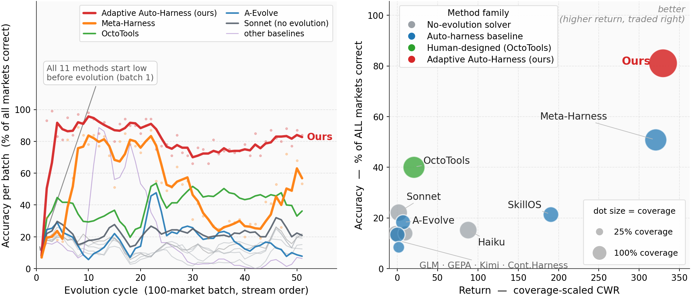

# Adaptive Auto-Harness

Code for the paper **"Adaptive Auto-Harness: Sustained Self-Improvement for
Agentic System Deployment on Open-Ended Task Streams."**

<p align="center">
  
</p>


## Project Structure

```
.
├── agent_evolve/                  # Core library
│   ├── algorithms/                # Evolution engine + routing + adaptation
│   ├── agents/{polybench,ctf_dojo,futurex}/   # Task-solving agents
│   ├── benchmarks/{polybench,ctf_dojo,futurex}/  # Task loading + scoring
│   ├── engine/                    # Evolution loop, versioning, observer
│   ├── protocol/adaptation/       # Pluggable solve-time adaptation operators
│   ├── contract/, llm/, tools/, utils/
├── experiments/                   # Configs + evolver prompts + seed harness
├── seed_workspaces/               # Initial harnesses per benchmark
├── scripts/                       # poly_/ctf_dojo_/futurex_hypothesis.sh launchers
├── evaluations/analysis_poly/     # Scripts that regenerate the README figures
├── assets/                        # README figures
├── data/                          # Dataset fetch helper + layout notes
└── solve_all_with_evolution.py    # Main entry point (all benchmarks)
```

## Installation

Requires **Python 3.11+** and (for PolyBench) **AWS Bedrock** access.

```bash
git clone -b release/adaptive-auto-harness https://github.com/A-EVO-Lab/a-evolve.git
cd a-evolve
conda create -n aevolve python=3.11 -y && conda activate aevolve
pip install -e ".[all]"
```

## Running PolyBench

PolyBench is pure reasoning (no Docker). From the repo root:

```bash
# 1. Configure credentials + models (export into the shell; scripts read env vars)
cp .env.template .env        # then edit: SOLVER_MODEL, EVOLVER_MODEL, AWS_* 
set -a; source .env; set +a

# 2. Get the dataset (SQLite snapshot of Polymarket markets)
python data/download_data.py --benchmark polybench   # -> data/polymarket_analysis.db

# 3. Smoke test: no-evolution baseline on 5 markets
bash scripts/poly_hypothesis.sh --limit 5 H0
```

Then run the paper's hypothesis cells (omit the target to run all):

```bash
bash scripts/poly_hypothesis.sh H0            # baseline: no evolution
bash scripts/poly_hypothesis.sh H1            # full evolution
bash scripts/poly_hypothesis.sh H4_multi      # multi-agent structured evolution
bash scripts/poly_hypothesis.sh H4_multi_nav  # + tree routing
```

Add `--adaptation <name>` to select the solve-time operator (default:
`tree_routing` when routing is enabled, else `whole_store`). Results land in
`results/polybench_<cell>/`, logs in `logs/`.

> CTF-Dojo and FutureX run the same way via `scripts/ctf_dojo_hypothesis.sh`
> and `scripts/futurex_hypothesis.sh`. See [`INSTALL.md`](INSTALL.md) for the
> full provider matrix and dataset notes.

## Adaptation as a Service

Solve-time adaptation is a **pluggable operator** chosen with
`--adaptation <name>`; operators live in
[`agent_evolve/protocol/adaptation/`](agent_evolve/protocol/adaptation/).

| `--adaptation` | Granularity |
|---|---|
| `whole_store`    | full harness |
| `tree_routing`   | whole branch (agentic router, paper default) |
| `retrieval`      | per-task top-k |
| `agentic_filter` | per-task LLM-selected subset |

More operators are on the TODO list (e.g. graph-structured store, lazy loading,
dependency-aware retrieval) — contributions welcome: add a class in
`operators.py` and one line in `registry.py`.

## License

MIT.
